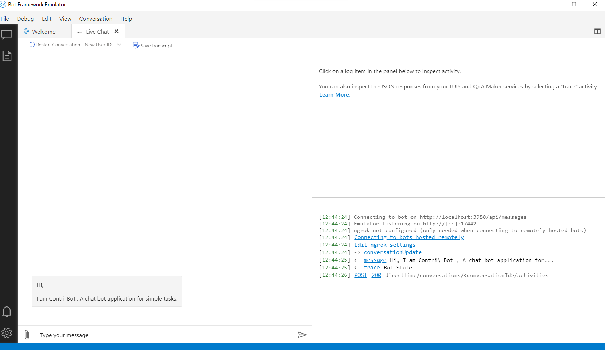

# Welcome to your ContriBot

ContriBot is the minimilistic chat bot which can do a lot of things but since is new ,can only do a handful of stuff.

ContriBot is one of the project of ContriHub 2022 under Avishkar 2022. 

This bot project was created using the Empty Bot template, and contains a minimal set of files necessary to have a working bot.

## Getting Started

### Installation

- [Install .NET Core SDK](https://dotnet.microsoft.com/download/dotnet-core/3.1)
- [Install Bot Composer Framework](https://docs.microsoft.com/en-us/composer/install-composer?tabs=windows)
- [Install Visual Studios](https://visualstudio.microsoft.com/)
- [Install Bot Emulator](https://github.com/microsoft/BotFramework-Emulator/releases)

### Running the project
- Git clone the repository.
- Start the Bot Composer Framework and open the bot.
- Run the the bot by clicking on start bot.

- After starting the bot you should be able to see this.

- Open the bot in the emulator by clicking on the "Test on emulator". You should be able to see the following.

### Hitting API
 To hit the api you need the look for the port on which bot is running (default is 3980) and simply use Postman / Terminal to hit the api as "http://localhost:[Port]/api/[EndPoint]".

### Editing Code

To add/modify/remove code open visual studios and locate the cloned project. Open .sln file in Visual Studios.Or simply open up the cloned folder with your favorite IDE (like Visual Studio).

## Contributor

[Divyansh Upadhyay](https://github.com/DuP-491)